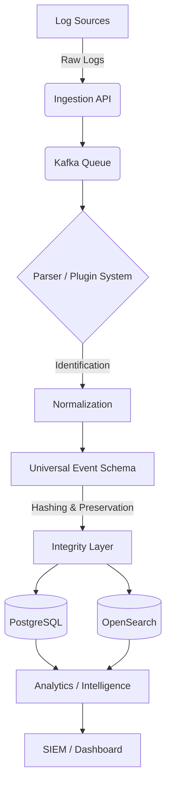

# 🔐 ULPF
### Universal Log Pre-processing Framework

> **From fragmented security logs to unified, analytics-ready intelligence.**


| | |
|---|---|
| **SIH** | Smart India Hackathon 2026 |
| **PSID** | 260156 |
| **Type** | Local / Docker-based |
| **Status** | Prototype / Working Implementation |

The Universal Log Processing Framework (ULPF) is a vendor-agnostic, lossless, and traceable security log preprocessing solution. It centralizes, normalizes, and enriches unstructured logs from diverse sources into a standard Universal Event Schema (UES), dramatically reducing noise and complexity before feeding data into downstream analytics engines or SIEMs.

```text
🔥 Diverse Security Logs
        ↓
⚙️ ULPF Processing
        ↓
🧩 Universal Event Schema
        ↓
📊 Analytics + Intelligence
        ↓
🔗 SIEM / Security Operations
```

## 🎯 Problem

Modern security operations struggle with diverse, unstructured, and vendor-specific log formats. SIEMs are typically clogged with noisy, hard-to-parse data, making threat detection slow, brittle, and exceedingly expensive.

## 💡 Solution

ULPF acts as an intelligent pre-processing layer that intercepts, identifies, and normalizes logs dynamically. By structuring data into a Universal Event Schema while preserving the cryptographic hash of the raw log, it guarantees data integrity and accelerates threat hunting without vendor lock-in.

## ✨ Key Features

| Feature | Description |
|---|---|
| **Universal Event Schema (UES)** | Normalizes diverse logs into a strictly typed, standardized JSON schema. |
| **Multi-format Parsing** | Dynamically identifies and parses logs via a hot-pluggable plugin architecture (e.g., Cisco ASA, AWS CloudTrail). |
| **Raw Log Preservation** | Retains the original raw log and generates a cryptographic hash to guarantee tamper-evidence. |
| **Analytics & Intelligence** | Computes contextual risk scores and detects anomalies automatically upon ingestion. |
| **SIEM Integration** | Provides structured, enriched data ready for seamless forwarding to any downstream SIEM. |
| **Robust Pipeline** | Handles high-throughput log bursts asynchronously using Apache Kafka and FastAPI. |

## 🏗️ Architecture



## 🛠️ Technology Stack

| Layer | Technologies |
|---|---|
| **Backend API** | Python 3, FastAPI, Pydantic |
| **Message Broker** | Apache Kafka |
| **Database (State)** | PostgreSQL |
| **Search & Analytics** | OpenSearch |
| **Frontend** | React, Vite |
| **Infrastructure** | Docker, Docker Compose |

## 🚀 Quick Start

Ensure you have **Docker** and **Docker Compose** installed. To get ULPF running locally:

```bash
# 1. Clone the repository
git clone https://github.com/Mazhar-khawaja/SIH26.git
cd SIH26

# 2. Configure environment
cp .env.example .env

# 3. Build and start the backend infrastructure
docker compose up -d --build

# 4. Verify all services are running
docker compose ps
```

### Start the Frontend

In a separate terminal window, start the React application:

```bash
cd frontend
npm install
npm run dev
```

> **Dashboard Access**: Navigate to [http://localhost:5173](http://localhost:5173) to view the ULPF Dashboard.
> **API Docs**: Access the Swagger UI at [http://localhost:8000/docs](http://localhost:8000/docs).

## 🧪 Quick Demonstration

1. Open the dashboard at `http://localhost:5173`.
2. Go to the **Submit Log** interface.
3. Paste a sample raw log (e.g., a Cisco ASA syslog snippet).
4. Watch ULPF instantly identify the log type, normalize it into the UES format, and compute the associated risk score and intelligence.
