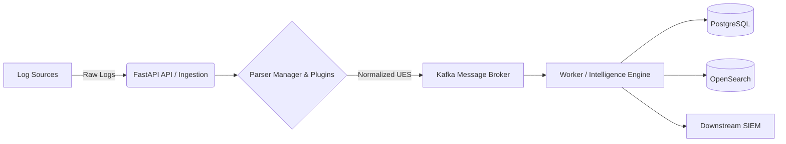

# ULPF Architecture

## 1. Problem & Objective
**Problem:** Modern security operations struggle with diverse, unstructured, and vendor-specific log formats. SIEMs are often clogged with noisy data, making threat detection slow and expensive.
**Objective:** The Universal Log Processing Framework (ULPF) provides a vendor-agnostic, lossless, and highly scalable pipeline to ingest, parse, normalize, and enrich security logs into a Universal Event Schema (UES) before downstream SIEM consumption.

## 2. High-Level Architecture Diagram

## 3. Processing Pipeline
1. **Ingestion:** API accepts raw logs individually or in bulk.
2. **Identification & Parsing:** The Parser Manager identifies the log type (e.g., Cisco ASA, AWS CloudTrail) and applies the correct plugin.
3. **Normalization:** The log is converted into the Universal Event Schema (UES).
4. **Enrichment & Analytics:** The worker consumes events from Kafka, computes risk scores, detects anomalies, and generates intelligence.
5. **Storage & Indexing:** The UES event is persisted in PostgreSQL (for traceability and state) and indexed in OpenSearch (for rapid searching and analytics).

## 4. Major Components
- **Ingestion API (FastAPI):** High-throughput, rate-limited endpoint for log submission.
- **Parser Plugins:** Modular Python plugins (e.g., `cisco_asa`, `aws_cloudtrail`) that can be hot-reloaded dynamically.
- **Kafka Queue:** Decouples ingestion from processing to handle high-velocity log bursts.
- **Analytics Worker:** Asynchronously processes logs from Kafka.

## 5. Data Flow
`Raw Log -> API -> Hash Generated (Integrity) -> Parser -> UES Mapping -> Kafka Topic -> Worker -> Analytics/Risk Engine -> PostgreSQL & OpenSearch`

## 6. Technology Stack
- **Backend:** Python 3, FastAPI, Pydantic
- **Message Broker:** Apache Kafka
- **Databases:** PostgreSQL (Relational/State), OpenSearch (Search/Analytics)
- **Frontend:** React, Vite
- **Deployment:** Docker, Docker Compose

## 7. Security / Integrity
- **Lossless Storage:** The raw log is preserved alongside the normalized UES data.
- **Traceability:** Every event is hashed upon ingestion to guarantee tamper evidence.
- **Role-Based Access Control (RBAC):** Distinct roles (Viewer, Analyst, Admin) secure API endpoints.

## 8. Deployment / Local Docker Architecture
- Containerized microservices network (`ulpf_network`).
- Dedicated volumes for PostgreSQL and OpenSearch data persistence.
- Easily scalable worker nodes via Kafka consumer groups.
